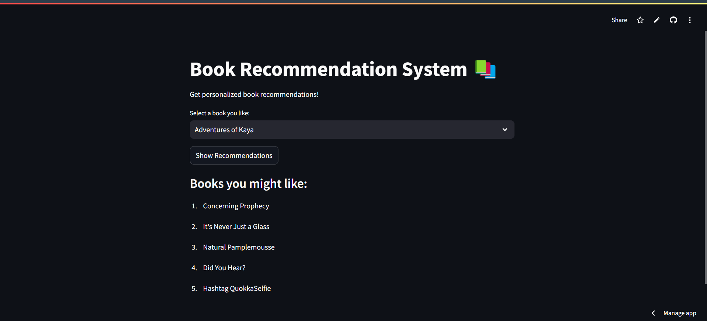

# Book Recommendation System

Book recommendation systems use machine learning to suggest books based on user preferences and behaviors. They employ methods like content-based filtering, which analyzes book features, and collaborative filtering, which finds patterns among users. Hybrid systems combine both approaches for better accuracy, enhancing personalization, user satisfaction, and business growth in the book industry.


## live Streamlit Link

[Book Recommendation System](https://bookrecommendationsystem-dhkrovxqssdnkjcjbo95ue.streamlit.app/)


## Screenshots




## Deployment

To deploy this project run

```bash
  pip install -r requirements.txt
```
 Run python file
```bash
  streamlit run app.py
```

